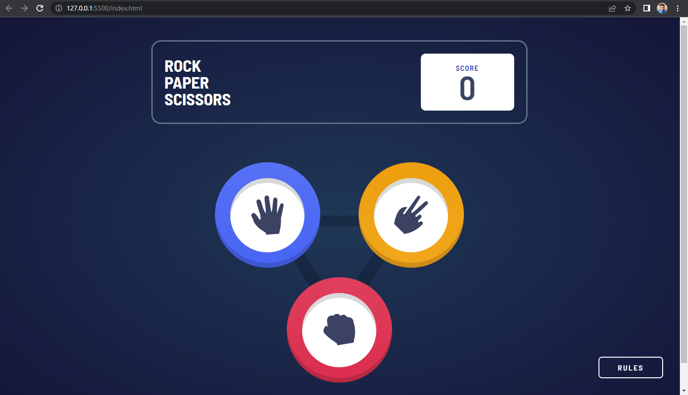
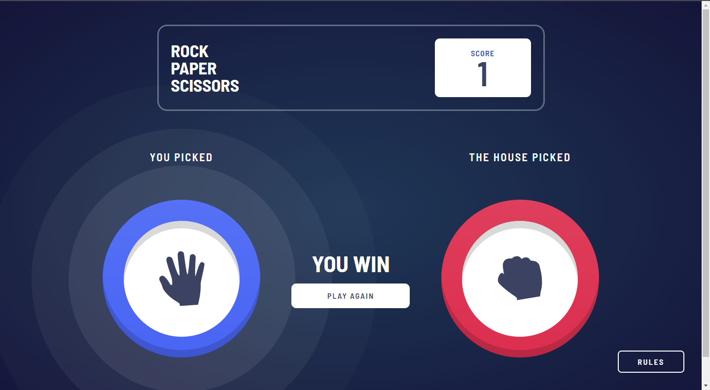
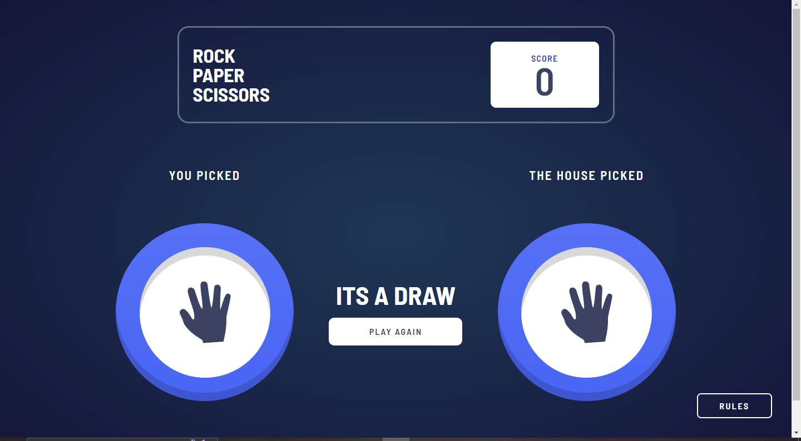
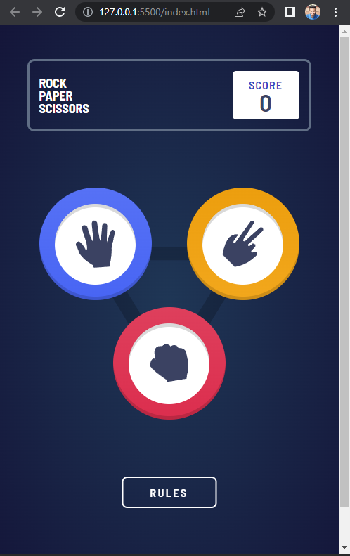
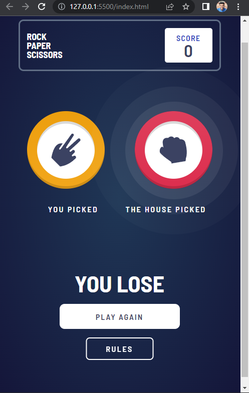
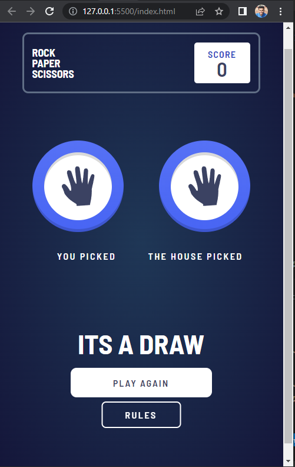

# Frontend Mentor - Rock, Paper, Scissors

## Figma Design

## Screenshot

### Desktop

### Mobile

        

**Users should be able to:**

- View the optimal layout for the game depending on their device's screen size
- Play Rock, Paper, Scissors against the computer
- Maintain the state of the score after refreshing the browser _(optional)_
- **Bonus**: Play Rock, Paper, Scissors, Lizard, Spock against the computer _(optional)_

### Rules

If the player wins, they gain 1 point. If the computer wins, the player loses one point.

